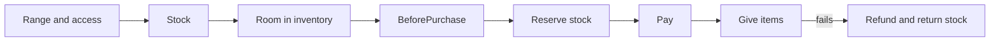

import { ModuleInfo } from "/snippets/module-info.jsx";

<Badge color="blue">Server</Badge> <Badge color="green">Client</Badge> Proxied to ug-core.

<ModuleInfo name="shops" deps={["inventory", "accounts"]} server="Shops" client="Shops" clientFunctions="GetAll, Open, Buy" />

Shops sell [items](/api/items) for an [account](/api/accounts). Prices, stock, distance and access are decided on the server. A client only says which item, by its position in the shop, and how many.

## Config

```lua config/shops.lua
return {
    shops = {
        general_store = {
            label = '24/7',
            coords = { vector3(25.7, -1347.3, 29.5), vector3(-3038.9, 585.9, 7.9) },
            account = 'cash',
            items = {
                { name = 'water', price = 5 },
                { name = 'bread', price = 8 },
                { name = 'bandage', price = 50, stock = 20, restock = 60 },
            },
        },
        police_armory = {
            label = 'Armory',
            coords = vector3(452.1, -980.0, 30.7),
            account = 'bank',
            jobs = { police = 2 },
            items = {
                { name = 'weapon_pistol', price = 0, metadata = { ammo = 60 } },
            },
        },
    },
}
```

| Field | Meaning |
| --- | --- |
| `label` | Up to 64 characters. |
| `coords` | One `vector3`, or a list for a chain of stores. |
| `distance` | Meters from any of the coords, 0.5 to 20. Defaults to 2.5. |
| `account` | The account that pays, from `config/accounts.lua`. |
| `items` | Up to 200, each sold once. |
| `jobs`, `gangs`, `groups` | Access, like [stashes](/api/inventory#stashes). None listed means everyone. |

| Item field | Meaning |
| --- | --- |
| `name` | An item from `config/items.lua`. |
| `price` | Per unit, 0 to 1,000,000,000. 0 is free. |
| `stock` | Most units in stock. Without it, the item never runs out. |
| `restock` | Minutes between refills to `stock`, 1 to 10,080. |
| `metadata` | Given with each unit, such as `{ ammo = 60 }` for a loaded weapon. |

Items, accounts and metadata are checked when ug-core starts: an unknown item or account stops boot with the shop name. The default config comes with a 24/7 and an Ammu-Nation.

## How a purchase works



1. The player is near one of the shop's coords, measured on the server, and has access.
2. There is enough stock, and the items fit in the player's inventory.
3. `Shops:BeforePurchase` allows it. It MAY lower the total, for a discount, never raise it.
4. The stock is reserved, then the account is charged with reason `shop:<name>`.
5. The items are added. If that fails, the account is refunded with reason `shop:<name>:refund` and the stock returns.

Both the [ledger](/api/accounts#getledger) and the [item audit log](/api/inventory#getlog) record the purchase. Weapons bought get their serial registered to the buyer.

## Server

### Buy

```lua
UgCore.Shops.Buy(source, shop, index, count) -> ok, errorCode
```

**MUST run in a thread.**

<ResponseField name="index" type="integer" required>Position of the item in the shop's `items`.</ResponseField>
<ResponseField name="count" type="integer" required>1 to 1,000.</ResponseField>

### Register

```lua
UgCore.Shops.Register(name, options)
```

Adds a shop from a resource, with the same fields as the config plus `check`, a function `fun(source): boolean` that MUST also pass. Registered shops leave when the resource stops. Their stock stays saved. Config names cannot be registered.

```lua
UgCore.Shops.Register('mechanic_parts', {
    label = 'Parts counter',
    coords = vector3(-347.2, -133.5, 39.0),
    account = 'bank',
    jobs = { mechanic = 1 },
    items = { { name = 'repair_kit', price = 150 } },
})
```

### Get / GetAll

```lua
UgCore.Shops.Get(name) -> { label, coords, distance, account, items, stock }?
UgCore.Shops.GetAll() -> string[]
```

`stock` maps limited items to their current stock.

### Restock

```lua
UgCore.Shops.Restock(name, item?) -> boolean
```

Refills limited items to their `stock` now. Without `item`, every limited item of the shop.

## Client

```lua
UgCore.Shops.GetAll() -> table<string, { label, coords }>
UgCore.Shops.Open(name) -> ok, errorCode, listing
UgCore.Shops.Buy(name, index, count) -> ok, errorCode
```

`GetAll` reads positions from `GlobalState['ug-core:Shops']`, for blips and markers. `Open` and `Buy` **MUST run in a thread**.

<ResponseField name="listing" type="table">
  <Expandable title="fields">
    <ResponseField name="label" type="string" />
    <ResponseField name="account" type="string" />
    <ResponseField name="items" type="{ index, name, price, stock? }[]">`stock` is missing for items that never run out.</ResponseField>
  </Expandable>
</ResponseField>

```lua client.lua
CreateThread(function()
    local ok, err, listing = UgCore.Shops.Open('general_store')

    if ok then
        -- show listing.items with labels from UgCore.Items.Get(item.name)
    end
end)
```

## Errors

| Code | When |
| --- | --- |
| `not_found` | Unknown shop or item position. |
| `no_permission` | Out of range, no access, or `BeforePurchase` cancelled. |
| `insufficient_items` | Not enough stock. |
| `cannot_carry` | The items do not fit in the player's inventory. |
| `insufficient_funds` | The account balance is too low. |
| `not_loaded` | No character is loaded. |

## Security

| Callback | Rate | Checks |
| --- | --- | --- |
| `ug-core:ShopOpen` | 3 per second | Loaded, alive, range and access. Replies the listing. |
| `ug-core:ShopBuy` | 4 per second | Loaded, alive, then every [purchase](#how-a-purchase-works) step. |

## Events

| Event | Arguments |
| --- | --- |
| `ug-core:Shops:Purchased` | `(source, shop, item, count, total, account)` |

## Hooks

| Hook | Payload |
| --- | --- |
| `Shops:BeforePurchase` | `{ source, shop, item, count, price, total, account }` |

Return `false` to cancel. Return the payload with a lower `total` for a discount:

```lua
UgCore.Hooks.Register(UgCore.Enums.Hooks.Shops.BeforePurchase, function(payload)
    if payload.item:find('^weapon_') and not Licenses.Has(payload.source, 'weapon') then
        return false
    end

    if UgCore.Permissions.IsInGroup(payload.source, 'vip') then
        payload.total = math.floor(payload.total * 0.9)
        return payload
    end
end)
```
