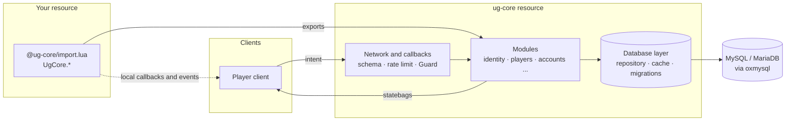
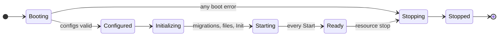
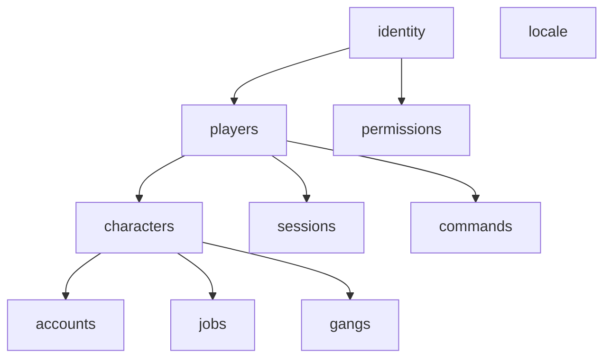

## The big picture

- **Server-authoritative.** Clients send intent through validated net events and callbacks. The server computes results.
- **Headless.** ug-core never draws. Players see results through UI resources that listen to events and statebags.
- **Read-heavy data replicates through statebags**: loaded state, death state, job, gang, session.

## Boot sequence

ug-core boots in a thread, so modules can wait on the database.

<Steps>
  <Step title="Booting">
    The banner prints. ug-core discovers modules from `ug_module` entries in its manifest and validates each `module.lua`.
  </Step>
  <Step title="Configured">
    `config/core.lua`, `config/guard.lua` and `config/modules.lua` load. Enabled modules are resolved, dependencies checked, cycles rejected, and each enabled module's config is generated and loaded.
  </Step>
  <Step title="Initializing">
    ug-core waits for oxmysql (at most 30 seconds), checks the database version and runs migrations. Then, module by module in dependency order: migrations, shared and server files, `Init`.
  </Step>
  <Step title="Starting">
    Every module's `Start` runs.
  </Step>
  <Step title="Ready">
    Connections are accepted. The summary line prints: `ug-core v1.0.0 ready in 61 ms. 10 modules enabled.`
  </Step>
</Steps>

Any error during boot is collected, printed, and moves ug-core to `Stopping`, then `Stopped`. Modules that already ran `Init` get their `Stop` in reverse order.

## How your resource reaches UgCore

`@ug-core/import.lua` loads part of ug-core into your resource and proxies the rest:

| Runs in your resource | Proxies to ug-core exports |
| --- | --- |
| `Callback`, `Network`, `Events` | `Config`, `Guard`, `Hooks` |
| `Schema`, `RateLimit` (server), `Logger` | Module namespaces: `Players`, `Accounts`, `Jobs` ... |
| `Enums`, `Modules`, `Version`, `Lifecycle` (mirror) | |

Callbacks and net events cost no export call per request. Central state such as Guard scores and the global request budget stays in ug-core. See [Importing UgCore](/developers/importing).

## Modules

Every feature beyond the core is a module in `modules/<name>/`:

<Tree>
  <Tree.Folder name="modules/accounts" defaultOpen>
    <Tree.File name="module.lua" />
    <Tree.File name="config.schema.lua" />
    <Tree.Folder name="sql" defaultOpen>
      <Tree.File name="v1.0.0.sql" />
    </Tree.Folder>
    <Tree.Folder name="server" defaultOpen>
      <Tree.File name="api.lua" />
    </Tree.Folder>
    <Tree.Folder name="client" defaultOpen>
      <Tree.File name="api.lua" />
    </Tree.Folder>
    <Tree.Folder name="shared" defaultOpen>
      <Tree.File name="enums.lua" />
    </Tree.Folder>
  </Tree.Folder>
</Tree>

Server module code is loaded with `LoadResourceFile` and never listed in the manifest, so clients never download it.

`identity`, `players` and `permissions` are required. Everything else is optional. See [Modules](/owners/modules).

## Layout of the resource

<Tree>
  <Tree.Folder name="ug-core" defaultOpen>
    <Tree.File name="fxmanifest.lua" />
    <Tree.File name="import.lua" />
    <Tree.Folder name="import">
      <Tree.File name="proxy.lua" />
      <Tree.File name="lifecycle.lua" />
    </Tree.Folder>
    <Tree.Folder name="core" defaultOpen>
      <Tree.Folder name="shared">
        <Tree.File name="init.lua · utils · enums" />
        <Tree.File name="logger.lua · version.lua · events.lua" />
        <Tree.File name="lifecycle.lua · modules.lua · schema.lua" />
      </Tree.Folder>
      <Tree.Folder name="server">
        <Tree.File name="config/ · database/ · modules/loader.lua" />
        <Tree.File name="guard.lua · hooks.lua · network.lua · callback.lua" />
        <Tree.File name="ratelimit.lua · assignments.lua · command.lua · boot.lua" />
      </Tree.Folder>
      <Tree.Folder name="client">
        <Tree.File name="config.lua · network.lua · callback.lua · boot.lua" />
      </Tree.Folder>
    </Tree.Folder>
    <Tree.Folder name="modules" />
    <Tree.Folder name="locales" />
    <Tree.Folder name="types" />
    <Tree.Folder name="config" />
  </Tree.Folder>
</Tree>
