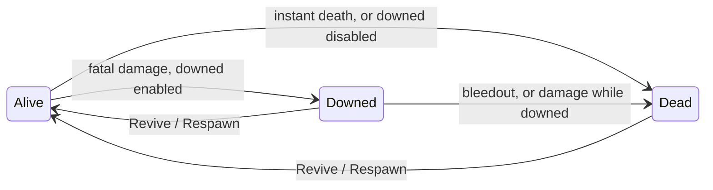

The `players` module owns death state, injuries and the downed flow. The server decides every transition. Resources such as `ug-ambulance` build scenes on top, through the API and hooks.

## States



| From | To | When |
| --- | --- | --- |
| `Alive` | `Downed` | Fatal damage and `downed.enabled`, unless an instant-death rule matches. |
| `Alive` | `Dead` | Fatal damage and downed disabled, or an instant-death rule matches. |
| `Downed` | `Dead` | Bleedout expires, or damage while downed with `downed.killOnDamage`. |
| `Downed`, `Dead` | `Alive` | `Revive` or `Respawn` only. Clients can never revive themselves. |

Instant death skips `Downed`: fatal gunshots to the head (`instantDeath.headshot`) and listed categories such as `Explosion`.

## How death is detected

<Steps>
  <Step title="The client reports">
    The client checks its own ped every 250 ms. When it becomes fatally injured, it reports once, with the last damaged bone.
  </Step>
  <Step title="The server confirms">
    The server reads the ped's health itself. Only health below 100 confirms the report. The weapon comes from `GetPedCauseOfDeath` and the killer from `GetPedSourceOfDeath`, both read on the server.
  </Step>
  <Step title="The killer is verified">
    A killer only counts when a `weaponDamageEvent` from that player hit the victim in the last 3 seconds. Otherwise the killer is unknown.
  </Step>
  <Step title="The state changes">
    The server records the injury, picks `Downed` or `Dead` from your config, and updates the `ug-core:DeathState` statebag.
  </Step>
</Steps>

A downed or dead player who moves more than 10 meters, or 3 meters when dead, from where they fell is flagged with `InvalidDeathState`.

## Injuries

Every hit is recorded. Hits on the same body region with the same category merge into one injury:

```lua
{
    region = 'LeftLeg',     -- Head, Neck, Torso, LeftArm, RightArm, LeftLeg, RightLeg, Unknown
    category = 'Gunshot',   -- Gunshot, Stab, Blunt, Explosion, Fire, Fall, Vehicle, Drowning, Animal, Unknown
    weapon = 453432689,     -- weapon hash of the last hit
    attacker = 7,           -- confirmed attacker, if any
    hits = 2,
    lastAt = 1790000000,
}
```

The fatal injury is also stored as the cause of death: `{ region, category, weapon, killer?, at }`.

## The downed flow

- The player is revived in place with low health and plays the downed animation.
- Shooting, aiming, melee, sprinting, jumping, entering vehicles and switching weapons are disabled. Dead players cannot move either.
- Bleedout runs on the server. When it expires, the player dies, unless `Players:BeforeBleedout` postpones it.
- Dead players stay in place, in the dead animation, until `Revive` or `Respawn`.
- spawnmanager's auto-respawn is turned off. UgCore owns respawning.

## Building an ambulance resource

```lua server.lua
-- Hold bleedout while CPR is running.
UgCore.Hooks.Register('Players:BeforeBleedout', function(payload)
    if cprInProgress[payload.source] then
        return false
    end
end)

-- Respawn only after hospital check-in.
UgCore.Hooks.Register('Players:BeforeRespawn', function(payload)
    return checkedIn[payload.source] == true
end)

-- Revive after your own checks.
local function revive(medic, patient)
    if not UgCore.Guard.IsNear(medic, GetEntityCoords(GetPlayerPed(patient)), 3.0) then
        return false
    end

    return UgCore.Players.Revive(patient, { by = medic, health = 150, clearInjuries = true })
end
```

Read `UgCore.Players.GetInjuries` and `GetCauseOfDeath` for diagnosis scenes, and `ClearInjuries(source, region)` to treat one region at a time.

## Persistence

With the `characters` module and `persistDeathState`, death state, injuries and cause of death are saved with the character. **Disconnecting never revives a player**: they come back downed or dead.

## Configuration

See `config/players.lua` in [Config files](/reference/config-files#players). PVP and racing servers usually set `downed.enabled = false` and `respawn.auto = true`.

## Known limitations

<Warning>
  Some lookup values are not documented by Cfx and are not yet verified on a live server: the ped bone ids that map to body regions, and the environment causes such as falling, drowning and vehicles. Unknown values map to `Unknown`, never to an error. Weapon categories come from the documented weapon list and are reliable.
</Warning>
