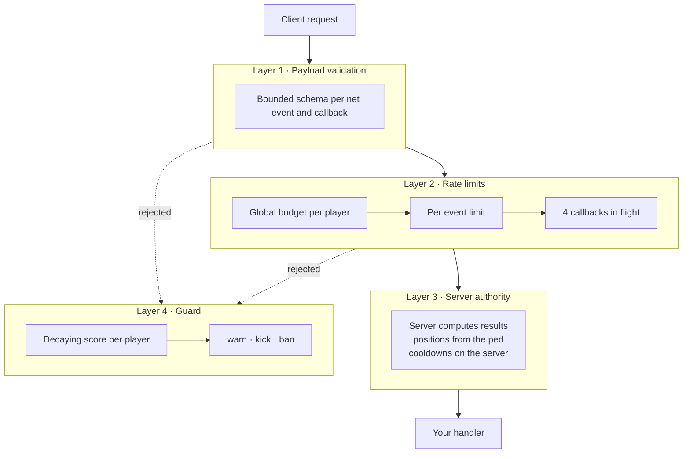

UgCore assumes any client can be modified. Protection comes in four layers. Each layer MUST work even if the others fail.



## Layer 1: payload validation

Every net event and callback has a schema. No schema, no registration. Schemas are bounded: strings, arrays and maps MUST declare a maximum, so a client cannot send a megabyte where a name was expected. See [Schemas](/developers/schemas).

## Layer 2: rate limits

- **Global budget**: one budget per player across every UgCore net event and callback, from every resource. 40 requests per second by default.
- **Per event**: each registration declares its own `rate`.
- **Concurrency**: at most 4 callbacks in flight per player.

Excess traffic is dropped before any handler runs.

## Layer 3: server authority

<Columns cols={2}>
  <Card title="Intent, not results" icon="hand">
    A client asks to buy an item. The server decides the price, checks the money and gives the item. A client never sends an amount to add.
  </Card>
  <Card title="Positions from the ped" icon="location-crosshairs">
    `UgCore.Guard.IsNear(source, coords, maxDistance)` reads the ped position on the server. Client coordinates are never trusted.
  </Card>
  <Card title="Identity from source" icon="id-card">
    The player is always the event `source`. Never read a player id or identifier from arguments.
  </Card>
  <Card title="Server-only state" icon="lock">
    Statebags are written by the server only. Cooldowns are enforced on the server.
  </Card>
</Columns>

```lua
local S = UgCore.Schema

UgCore.Callback.Register('BuyItem', {
    schema = S.Define({ S.Enum({ 'water', 'bread' }) }),
    rate = { max = 2, per = 1000 },
    requirePlayer = true,
}, function(source, item)
    if not UgCore.Guard.IsNear(source, SHOP_COORDS, 3.0) then
        UgCore.Guard.Flag(source, 'OutOfRange', 'BuyItem')
        return false
    end

    local price = PRICES[item] -- the server decides the price

    return (UgCore.Accounts.Remove(source, 'cash', price, 'Bought ' .. item))
end)
```

## Layer 4: Guard

Every rejection adds to the player's score. Your own checks report with `UgCore.Guard.Flag`. Scores decay; thresholds warn, kick or ban. See [Guard](/owners/guard).

## What never reaches a client

- Stack traces. Handlers that crash answer `internal_error`.
- Which check failed. Kick and ban messages are generic.
- Validation details. They go to server logs, without echoing large input.

## Spoofed core events

`ug-core:*` events are only accepted from ug-core itself. Another resource, or a client through a misconfigured net event, cannot fake them. See [Events](/developers/events#spoofing-protection).

## Recommended server settings

Lock entity creation from clients with FXServer's `sv_entityLockdown`. Sessions created by UgCore already use `strict` lockdown. Check the Cfx documentation for current values before setting it server-wide.
