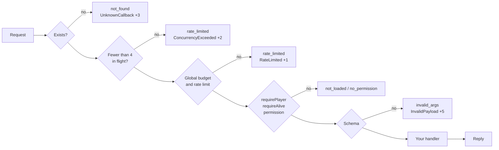

A callback lets a client ask the server for something and get an answer. UgCore validates every request before your handler sees it.

## Register on the server

```lua server.lua
local S = UgCore.Schema

UgCore.Callback.Register('GetBalance', {
    schema = S.Define({ S.Enum({ 'cash', 'bank' }) }),
    rate = { max = 5, per = 1000 },
    requirePlayer = true,
}, function(source, account)
    return UgCore.Accounts.GetBalance(source, account)
end)
```

The name is prefixed with your resource: clients call `my-bank:GetBalance`.

### Options

<ResponseField name="schema" type="UgSchema" required>
  Arguments, from `UgCore.Schema.Define`. No schema, no registration.
</ResponseField>
<ResponseField name="rate" type="{ max: integer, per: integer }" required>
  Per-player token bucket: `max` calls burst, refilled over `per` ms.
</ResponseField>
<ResponseField name="requirePlayer" type="boolean">
  Rejects players whose `ug-core:Loaded` statebag is not true, with `not_loaded`.
</ResponseField>
<ResponseField name="requireAlive" type="boolean">
  Rejects downed and dead players with `no_permission`. They are not flagged.
</ResponseField>
<ResponseField name="permission" type="string">
  ACE the player MUST have, such as `ug.admin`.
</ResponseField>

### Handler

The handler gets the player's `source` and the validated arguments, and returns one value. It runs in a thread, so it can wait on the database.

If it raises, the client gets `internal_error` and the error is logged on the server. Clients never see stack traces.

## Call from the client

```lua client.lua
CreateThread(function()
    local ok, balance, errorCode = UgCore.Callback.Await('my-bank:GetBalance', 'bank')

    if ok then
        print('Balance: ' .. balance)
    else
        print('Failed: ' .. errorCode)
    end
end)
```

`Await` MUST run in a thread. It times out after 10 seconds. Late answers are ignored.

Use `Trigger` to avoid blocking:

```lua client.lua
UgCore.Callback.Trigger('my-bank:GetBalance', function(ok, balance, errorCode)
    -- ...
end, 'bank')
```

## The pipeline

Every request goes through these checks, in order. The first failure answers with an error code and, for most checks, adds to the player's [Guard](/owners/guard) score.



Malformed requests, such as a missing request id, are flagged and get no answer at all.

## Server to client

The server can ask a client too. The answer is untrusted input, so it MUST match a schema:

<CodeGroup>

```lua client.lua
UgCore.Callback.Register('GetSettings', function(key)
    return GetResourceKvpString(key)
end)
```

```lua server.lua
local ok, value, errorCode = UgCore.Callback.Await(source, 'my-hud:GetSettings', {
    schema = UgCore.Schema.String({ max = 64 }),
    timeout = 5000,
}, 'theme')
```

</CodeGroup>

Answers from another player are ignored. A request resolves with `timeout` when the player drops.
