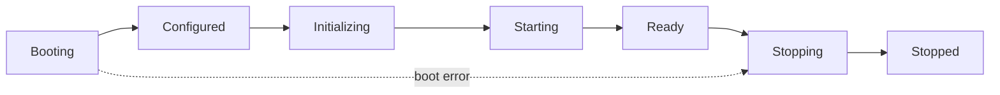

ug-core moves through seven states, always forward:



A state can be skipped: a failed boot goes from `Booting` straight to `Stopping`. A skipped state is never reached.

## Wait for Ready

<CodeGroup>

```lua Non-blocking
UgCore.Lifecycle.On('Ready', function()
    -- Runs when ug-core is ready, or right away if it already is.
end)
```

```lua Blocking
CreateThread(function()
    if UgCore.Lifecycle.Await('Ready', 30000) then
        -- ready
    end
end)
```

</CodeGroup>

`On` is sticky: a handler for a state already reached runs immediately. It never runs for a skipped state. `Await` returns `false` on timeout or when the state is skipped.

## Check the state

```lua
UgCore.Lifecycle.GetState()             -- 'Ready'
UgCore.Lifecycle.IsReady()              -- true
UgCore.Lifecycle.HasReached('Starting') -- true
```

## Lifecycle events

| Event | Arguments |
| --- | --- |
| `ug-core:Lifecycle:Changed` | `newState, oldState` |
| `ug-core:Lifecycle:Ready` | |
| `ug-core:Lifecycle:Stopping` | |

In your resource, `UgCore.Lifecycle` mirrors ug-core's state from these events. When ug-core restarts, your handlers keep working.
